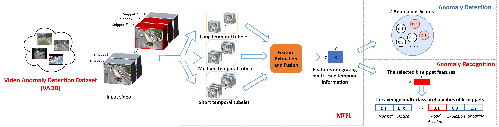

# MTFL

This repo is the official Pytorch implementation of our paper:

> [**MTFL: Multi-Timescale Feature Learning for Weakly-supervised Anomaly Detection in Surveillance Videos**](https://arxiv.org/pdf/2410.05900v1.pdf)
>
<!--Author list-->

## Introduction


Detection of anomaly events is relevant for public safety and requires a combination of fine-grained motion information and long-time action recognition. Therefore, we propose a Multi-Timescale Feature Learning (MTFL) method to enhance the representation of anomaly features. We employ short, medium, and long temporal tubelets to extract spatio-temporal video 
features using the Video Swin Transformer. Experimental results demonstrate that 
MTFL outperforms state-of-the-art methods on the UCF-Crime dataset, achieving an 
anomaly detection performance 89.78% AUC. Moreover, it performs 95.32% AUC on the 
ShanghaiTech and 84.57% AP on the XD-Violence dataset, complementary to several
SotA results. Building upon MTFL, we also propose an anomaly recognition network 
that employs partial features for classification, achieving a leading accuracy on 
UCF-Crime, outperforming the existing recognition literature. Furthermore, 
we introduce an extended dataset for UCF-Crime, 
namely Video Anomaly Detection Dataset (VADD), 
involving 2,591 videos in 18 classes with extensive coverage of realistic anomalies. 

## Models and Dataset
### [Video Anomaly Detection Dataset (VADD)](https://form.jotform.com/240714220958354)


VADD includes 2,591 videos with a frame rate of 30 fps and a 
resolution of 320×240 pixels, with 2,202 train and 389 test videos. 
The subfolders in VADD are named according to video categories, totaling 18 subfolders.
Train-set annotations only include a class label, while test-set annotations contain a 
video class label, a number of frames in a video, as well as the starting and 
ending frame positions of abnormal events in a video.
```
# Training annotation
[Subfolder/video name] [video label]
# Test annotation
[Subfolder/video name] [video label] [total frames] [start_frame1] [end_frame1] [start_frame2]...
```
* Taking a training video containing littering as an example, it is annotated as below: 
```
Littering/CarSafe015.mp4 Littering
```
* Taking a test video containing dangerous throwing behavior as an example, 
its annotations indicate that the video has a total of 636 frames and 
there are two instances of dangerous throwing behavior. 
The first instance occurs between frames 145 and 186, 
while the second instance occurs between frames 289 and 340.
```
DangerousThrowing/BicyclistDangerous039.mp4 DangerousThrowing 636 145 186 289 340
```

Additionally, to train and test our MTFL with benchmark datasets, 
we converted annotation files from other datasets to match the format of VADD annotation
files, including Shanghai Tech, XD-Violence, and UCF-Crime. 

All train and test annotation files for AnomalyDetection and AnomalyRecognition are provided in the ["Annotation".](https://tuenl-my.sharepoint.com/:f:/r/personal/e_akdag_tue_nl/Documents/MTFL/annotation?csf=1&web=1&e=UYxR0H).

### [MTFL checkpoints for anomaly detection](https://tuenl-my.sharepoint.com/:f:/r/personal/e_akdag_tue_nl/Documents/MTFL/MTFL-checkpoints?csf=1&web=1&e=hJhPgh)

| Detection Checkpoint | Feature       | UCF   | Shanghai<br/>Tech | XD-Violence | VADD |
|------------------|---------------|-------|--------------|-------------|---|
| MTFL_VST_Kinetics400 | VST-RGB       | 87.61 | 95.32        | 84.57       | - |
| MTFL_VST_VADD    | VST<sub>Aug</sub>_RGB | 89.79 | 95.70 | 79.40 | 88.42 |

There are several MTFL checkpoints for anomaly detection using different feature extractors 
and datasets where, 
* xxx_VST_Kinetics400 = Features extracted using VST pretrained on Kinetics400, 
* xxx_VST_VADD = Features extracted using VST pretrained on VADD with data augmentation. 
* MTFL-yyy-VST-Kinetics400 =  MTFL models trained with VST_RGB features.
* MTFL-yyy-VST-VADD = MTFL models trained with VST<sub>Aug</sub>_RGB features.
xxx = Shanghai, VADD, and XD.
yyy = SH, VADD-UCF, and XD.

Two feature extractors used in our detection models and 
the resulting features of benchmark datasets are provided below:
* [Video Swin Transformer pretrained on Kinetics-400](https://tuenl-my.sharepoint.com/:u:/r/personal/e_akdag_tue_nl/Documents/MTFL/feature-extractors/AnomalyDetection/swin_base_patch244_window877_kinetics400_22k.pth?csf=1&web=1&e=8spheA)
* [Video Swin Transformer pretrained on VADD](https://tuenl-my.sharepoint.com/:u:/r/personal/e_akdag_tue_nl/Documents/MTFL/feature-extractors/AnomalyDetection/VST_swin_base_patch244_window877_VADD.pth?csf=1&web=1&e=AzfewH)
* [VST_RBG features of UCF-Crime, XD-Violence, Shanghai Tech, and VADD](https://tuenl-my.sharepoint.com/:f:/r/personal/e_akdag_tue_nl/Documents/MTFL/features/AnomalyDetection?csf=1&web=1&e=CT8WZ3)
* [VST<sub>Aug</sub>_RGB features of UCF-Crime, XD-Violence, Shanghai Tech, and VADD](https://tuenl-my.sharepoint.com/:f:/r/personal/e_akdag_tue_nl/Documents/MTFL/features/AnomalyDetection?csf=1&web=1&e=CT8WZ3)

The Video Swin Transformer model pretrained on Kinetics400 and 
the training method for Video Swin Transformer are derived from 
the [Video-Swin-Transformer repository](https://github.com/SwinTransformer/Video-Swin-Transformer).


### [MTFL checkpoints for anomaly recognition](https://tuenl-my.sharepoint.com/:f:/r/personal/e_akdag_tue_nl/Documents/MTFL/MTFL-checkpoints/AnomalyRecognition?csf=1&web=1&e=NOkpNn) 


| Recognition Checkpoint        | UCF Acc(%) | VAD Acc(%) |
|-------------------------------|------------|------------|
| MTFL_VADDsplit1_best_UCF      | 39.88      | -          |
| MTFL_VADDsplit1_best_VADD     | -          | 45.87      |
| MTFL_VADDsplit2_best_UCF      | 47.02      | -          |
| MTFL_VADDsplit2_best_VADD     | -          | 49.31      |
| MTFL_VADDsplit3_best_UCF      | 49.40      | -          |
| MTFL_VADDsplit3_best_VADD     | -          | 53.88      |
| MTFL_VADDsplit4_best_UCF_VADD | 45.83      | 52.29      |
| 4-fold average                | 45.53      | 50.34      |

Following the experimental setup of 4-fold cross-validation from [Sultani et al](https://arxiv.org/abs/1801.04264), 
there are seven recognition checkpoints by saving the checkpoints that performed the best on 
UCF and VADD separately during training on different VADD splits, as shown in the above table. For example, 
MTFL_VADDsplit1_best_UCF represents the MTFL recognition model trained on VADD
split 1 with the best recognition performance on UCF-Crime split 1 test-set. 
All the models use VST trained on the corresponding VADD splits 
for feature extraction. 

* [The used feature extractors for anomaly recognition](https://tuenl-my.sharepoint.com/:f:/r/personal/e_akdag_tue_nl/Documents/MTFL/feature-extractors/AnomalyRecognition?csf=1&web=1&e=ToseKM) 
* [The generated features for anomaly recognition](https://tuenl-my.sharepoint.com/:f:/r/personal/e_akdag_tue_nl/Documents/MTFL/features/AnomalyRecognition?csf=1&web=1&e=4nbEUm)


## Environment setup
```
pip install -r requirements.txt
```
## Folder Structure
```flow
demo/  
│  
├── detection/       # MTFL detection
│   └── ...
├── recognition/     # MTFL recognition
│   └── ... 
├── utils/  
│   ├── swin_config/ # VST config for loading feature extractor
│   │   └── ...  
│   ├── feature_extractor.py   
│   ├── ...   
│   └── video_preprocessing/ # scripts for annotation and unifying video format
│       └── ...
├── test_videos/     # put your test video here
├── Annotation/      # put your annotation here
├── features/        # feature path
│   ├── L8  
│   ├── L32   
│   └── L64  
├── results/       
│   ├── AUC          # detection AUC
│   ├── scores       # detection scores
│   └── rec_results  # recognition labels   
└── README.md 
```


## Feature Extraction
Both recognition and detection models require multi-timescale features using tubelets 8, 32, and 64 frames.
To extract features, you need to upload the videos to the 'test_videos' directory and then run the following command:
```
python utils/feature_extractor.py --clip_length [8/32/64]
```
In the default settings, test videos should be stored in the 'test_videos' directory, and the extracted features will be 
organized within the 'features' folder following the same directory structure as 'test_videos'. 
For example, the feature of video 'test_videos/A/B.mp4' extracted with a frame length 8 is saved as 'features/L8/A/B.txt'.

You can modify the parameters inside the "VST Feature Extractor Parser" as needed. 
For example, you can change the input video path, the save path of features and the used pretrained feature extractor by specifying the model path.
```
python utils/feature_extractor.py --clip_length [8/32/64] --dataset_path [your video path] --save_dir [your feature path] --pretrained_3d [model path]
```
Note: if you use VST pretrained on Kinetics400, you need to change <num_classes> to 400 in line 21 of 
'utils/swin_config/_base/models/swin/swin_tiny.py' to adapt the model size. For VST pretrained on VADD, the <num_classes>
is 18. These settings are referenced from the guidelines provided by 
[Video-Swin-Transformer repository](https://github.com/SwinTransformer/Video-Swin-Transformer).


## Anomaly Detection
### Inference
To test a detection checkpoint model on your test videos, run:
```
python detection/test.py --test_anno [your_anno_file.txt] --detection_model [checkpoint path]
```


In the default settings:

* Test videos should be stored in the 'test_videos' directory.
* The corresponding annotation file need to be placed in the 'annotation' folder. Annotation format can be found under Video Preprocessing->Annotation.
* Multi-temporal scale features of the videos should be stored in the 'features' directory. See Feature Extraction.


The detection AUC and the scores for each video will be generated within the 'results' folder. 
The directory structure of the generated results, in relation to both 'results/AUC' and 'results/scores', mirrors the 
structure of the corresponding test videos in the 'test_videos' directory. For example, 
the score of video 'test_videos/A/B.mp4' is saved as 'results/scores/A/B.png' 

If you want to change paths to input and output data or any running configs, 
feel free to change the args in 'detection/option.py'.

### Train
To train a detection model, run:
```
python detection/train.py --train_anno [your_train_anno_file.txt] --test_anno [your_test_anno_file.txt] 
--lf_dir [path to long frame length features] --mf_dir [path to medium frame length features] --sf_dir 
[path to short frame length features] --save_models [path for saving checkpoints] --output_dir [path for saving checkpoint AUC]
```

Other training parameters can be found in 'detection/option.py'

## Anomaly Recognition
### Inference
To test a recognition checkpoint model on your test videos, run
```
python recognition/test.py --test_anno [your_anno_file.txt] --recognition_model [checkpoint path]
```

The default settings are same as Detection, and the modifiable parameters are in 'recognition/option.py'. 
The recognition results of all input will be saved as 'results/rec_results/output_pred.txt'. 


### Train
To train a recognition model, run:
```
python recognition/train.py --train_anno [your_train_anno_file.txt] --test_anno [your_test_anno_file.txt]
--lf_dir [path to long frame length features] --mf_dir [path to medium frame length features] --sf_dir 
[path to short frame length features] --save_models [path for saving checkpoints] --output_dir [path for saving checkpoint AUC]
```

Note: following the experimental setup of 4-fold cross-validation from [Sultani et al](https://arxiv.org/abs/1801.04264),
 there are four pairs of training annotation and testing annotation files corresponding to four splits for each dataset,
 which are provided in in the "annotation" folder accessible through the above VADD link.
Make sure the correspondence between the training and testing files; otherwise, there are data leakage issues.
Other training parameters can be found in 'recognition/option.py'

## Acknowledgement

Partial code is used from 
[Video-Swin-Transformer](https://github.com/SwinTransformer/Video-Swin-Transformer)
and [RTFM](https://github.com/tianyu0207/RTFM)
<!--## Citation

If you find this repo useful for your research, please consider citing our paper:-->

